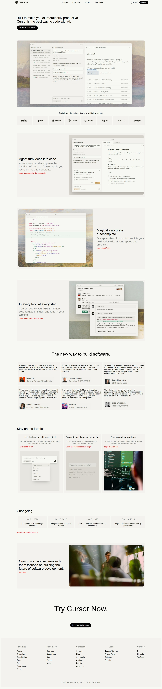

# Cursor Landing Page – UI Recreation

This project is a front-end recreation of selected sections from the Cursor website.  
The goal of the assignment was to practice layout structuring, visual hierarchy, spacing, and component styling while matching the look and feel of a modern SaaS landing page.



---

## 📌 Sections Recreated

The following parts of the landing page were implemented:

### 1. Header / Navbar
- Cursor logo  
- Navigation links (Product, Enterprise, Pricing, Resources)  
- Sign in + Download buttons  

### 2. Hero Section
- Main headline  
- Supporting text  
- Primary CTA button  
- Product preview image  

### 3. Trusted By / Companies Row
- Brand logos displayed in a horizontal layout  

### 4. Feature Sections
Alternating image–text layout blocks including:
- **Agent turn ideas into code**
- **Magically accurate autocomplete**
- **In every tool, at every step**

Each block includes:
- Title  
- Description  
- Learn more link  
- UI preview image  

### 5. Testimonials
- User quotes  
- Profile names & roles  

### 6. Stay on the Frontier
- Three-column feature grid  
- Short descriptions  
- Explore links  

### 7. Changelog
- Release dates with brief updates  

### 8. Call To Action (CTA)
- “Try Cursor Now”  
- Download button  

### 9. Footer
- Multi-column structured links (Product, Resources, Company, Legal, Connect)

---

## 🎨 Fonts Used

The design follows a clean, modern sans-serif style similar to the original site.

**Primary Font Stack:**
```css
font-family: -apple-system, BlinkMacSystemFont, "Segoe UI", Roboto, Helvetica, Arial, sans-serif;
```
This ensures:

- Good readability  
- Cross-platform consistency  
- Native UI feel  

---

## 🌈 Colors Used

Approximate palette derived from the UI:

| Purpose | Color |
|--------|-------|
| Primary text | `#111111` |
| Secondary text | `#6b7280` |
| Light gray text | `#9ca3af` |
| Background | `#ffffff` |
| Section background | `#f7f7f7` / `#fafafa` |
| Borders | `#e5e7eb` |
| Primary button | `#000000` |
| Button text | `#ffffff` |
| Links / highlights | `#ef4444` (soft red accent) |

---

## 🧱 Layout & Design Approach

- Built with reusable sections  
- Flexbox / Grid used for alignment  
- Consistent spacing system  
- Responsive behavior considered for smaller screens  
- Emphasis on typography and whitespace to match a premium product aesthetic  

---

## 🎯 Learning Goals of This Project

Through this recreation, I practiced:

- Translating real product UI into code  
- Building structured landing pages  
- Creating reusable components  
- Improving CSS positioning & responsiveness  
- Observing professional design systems  

---

## 🚀 How to Run

1. Clone the repository  
2. Open `index.html` in your browser  

---

## 🙌 Acknowledgment

Design inspiration from the official Cursor website.  
This project is for educational and practice purposes only.

